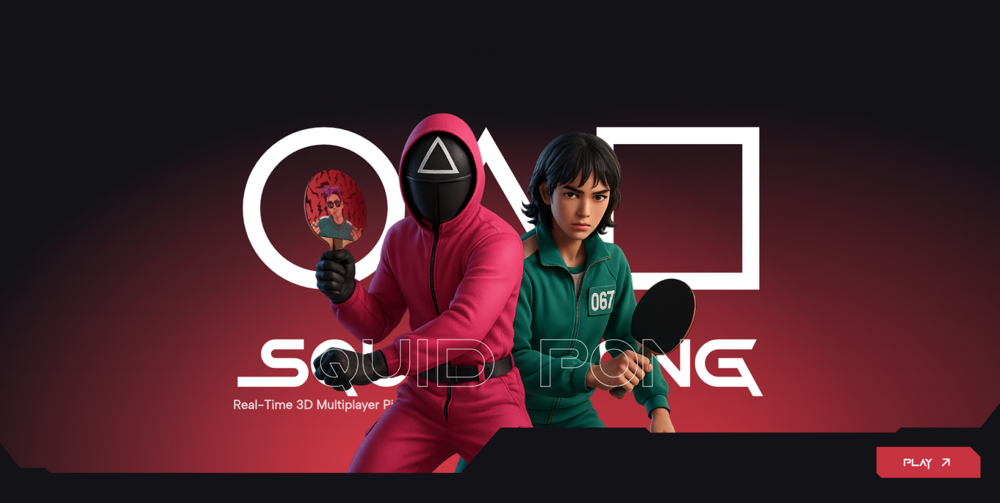
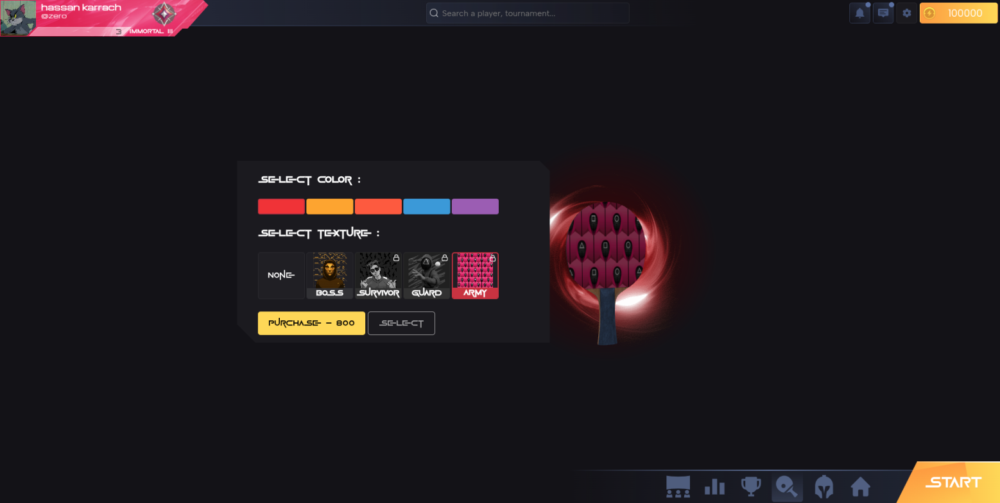
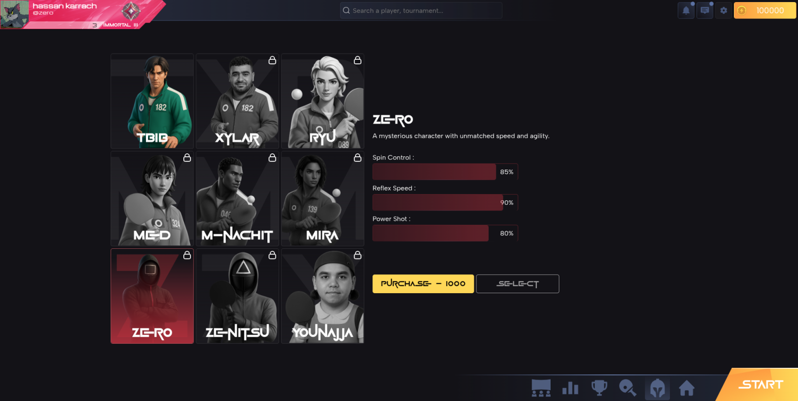
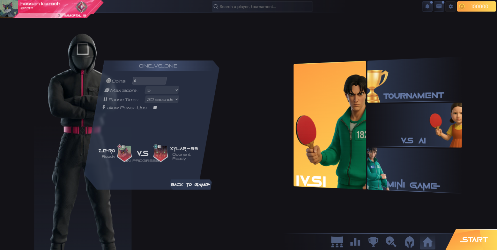

<!-- Demo Video (GitHub-safe: clickable preview) -->
<p align="center">
   <a href="https://vimeo.com/1148070523" target="_blank" rel="noopener noreferrer">
      
   </a>
</p>

# SquidPong 🏓

A modern, real-time multiplayer Pong reinvented in 3D. Play ranked 1v1s, join tournaments, chat with friends, unlock badges, and spectate live matches — all in your browser.

## Screenshots

<p align="center">
    
   
</p>
<p align="center">
    
   
</p>

## What is SquidPong?

SquidPong brings the arcade classic to the modern web with polished 3D visuals, smooth physics, competitive modes, and social features. It’s built as a microservices project to be scalable and fun to hack on.

### Key Features
- Real-time multiplayer with low-latency gameplay
- 3D visuals powered by Babylon.js
- Tournaments, leaderboards, and badges
- Match invitations and spectator mode
- Customizable characters and paddles
- In-game chat and notifications
- Dockerized development with one command startup

## Tech Stack

### Frontend
- Zeroact (custom React-like UI framework)
- TypeScript + Vite
- Babylon.js (3D engine)
- Rapier3D (physics)
- GSAP (animations)

### Backend
- Fastify (Node.js web framework)
- TypeScript
- Prisma ORM (SQLite by default)
- RabbitMQ (message broker)
- Redis (cache/session)

### Infrastructure
- Docker + Docker Compose
- Nginx (reverse proxy, TLS)
- SSL certificates via `certs/`

## Getting Started

### Prerequisites
- Docker (v20+)
- Docker Compose (v2+)
- Make

### Setup
1. Clone the repo
   ```bash
   git clone https://github.com/TRAN5PONG/SquidPong.git
   cd SquidPong
   ```
2. Create env files (examples vary by service):
   - `frontend/.env`
   - `backend/gateway/.env`
   - `backend/services/auth/.env`
   - `backend/services/user/.env`
   - `backend/services/chat/.env`
   - `backend/services/game/.env`
   - `backend/services/tournament/.env`
   - `backend/services/notify/.env`
3. Add TLS certs
   ```bash
   mkdir -p certs
   # place your certificate/key files into certs/
   ```
4. Build & run everything
   ```bash
   make up
   ```
5. Open the app
   - Frontend: https://localhost:4433

### Make Targets
- `make up` — build and start all services with checks
- `make start` — start already-built services (detached)
- `make stop` — stop services
- `make down` — stop and remove containers/images
- `make status` — quick health check of core services

## Project Structure
```
SquidPong/
├─ frontend/                # UI, 3D scene, assets
│  ├─ src/components/       # UI + game views
│  ├─ src/api/              # REST/WebSocket clients
│  ├─ src/contexts/         # app contexts
│  ├─ src/hooks/            # custom hooks
│  ├─ src/store/            # state management
│  ├─ src/types/            # shared types
│  └─ public/               # static assets
│
├─ backend/
│  ├─ gateway/              # API gateway & routing
│  └─ services/
│     ├─ auth/              # authentication
│     ├─ user/              # profiles, uploads
│     ├─ chat/              # realtime chat
│     ├─ game/              # game logic & state
│     ├─ tournament/        # brackets & matches
│     └─ notify/            # notifications
│
├─ scripts/                 # helper scripts
├─ postman/                 # API collections
├─ certs/                   # TLS materials
├─ docker-compose.yml       # orchestration
├─ nginx.conf               # reverse proxy
└─ Makefile                 # developer commands
```

## Architecture
- Gateway as the single entry point (routing, auth)
- Domain microservices (auth, user, chat, game, tournament, notify)
- Async communication via RabbitMQ; caching/sessions via Redis
- Prisma per service where needed (SQLite by default)

## Development
- Run in dev mode with hot reload via `make up`
- Inspect DBs with Prisma:
  ```bash
  # inside a service container
  npx prisma db push
  npx prisma studio
  ```

## Game Mechanics
- Physics-based ball and paddle interactions
- Score to win; configurable match rules
- Power-ups (speed, size, specials)
- Modes: quick match, invite, tournament, spectate

## Networking Concepts (Short)
- Rollback netcode: Re-simulate recent frames on late inputs using deterministic physics to keep fair, consistent state.
- Client-side prediction: Apply inputs instantly locally to hide latency; correct with server snapshots.
- Interpolation: Smooth movement by rendering between past snapshots, reducing jitter and rubber-banding.
- Extrapolation: Temporarily predict next state from velocity when data is missing; clamp duration to avoid overshoot.
- Tick rate & snapshots: Fixed timestep with tick IDs; periodic state snapshots keep clients in sync.
- Lag compensation: Server rewinds relevant state to the shooter’s perceived time for fair collision checks.
- Input buffering: Timestamp and queue inputs to survive packet loss and maintain ordering.
- Deterministic physics: Same timestep/order/RNG seeds ensure identical replays during rollback.
- Time sync: Align client/server clocks (monotonic offsets) to map inputs to the correct ticks.

## Contributing
1. Fork the repo
2. Create a branch: `git checkout -b feature/awesome`
3. Commit: `git commit -m "feat: add awesome"`
4. Push: `git push origin feature/awesome`
5. Open a Pull Request

## Troubleshooting
- Port in use? Stop conflicting services and retry
- Nginx not serving? Check `certs/` and `docker logs nginx`
- Env issues? Verify each service `.env` values
- DB errors? `npx prisma db push` inside the service

## License
For learning and experimentation. Not licensed for commercial use.

## Acknowledgments
- Inspired by the original Pong
- Thanks to the open-source community for the tools we use
